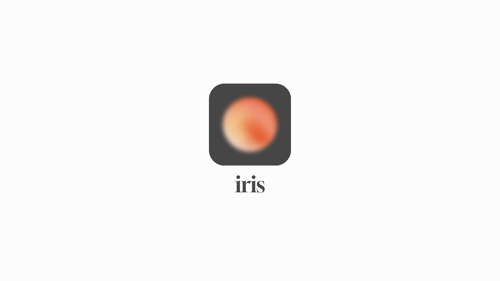

# Iris - Personal Travel Assistant
Iris is a personal travel assistant that uses AI to help track and manage travel plans by monitoring emails for travel-related emails.



## Features

- 🔍 Automatically detects travel-related emails in emails
- ✈️ Tracks flights, hotel bookings, and activity reservations
- 🔄 Handles booking updates and cancellations
- 📅 Maintains an up-to-date travel itinerary
- 🕒 Filters past and upcoming travel items

## Setup

1. Create a virtual environment and activate it:```bash
python3 -m venv venv
source venv/bin/activate  # On Windows: venv\Scripts\activate
```

2. Install dependencies:
```bash
pip install -r requirements.txt
```

3. Set up Gmail API:
   - Create a Google Cloud Project
   - Enable the Gmail API
   - Create OAuth 2.0 credentials
   - Download the credentials and save as `gmail-oauth.json`

4. Create a `.env` file with your OpenAI API key:
```
OPENAI_API_KEY=your_api_key_here
```

## Usage

1. Run the travel assistant:
```bash
python travel_assistant.py
```

2. To process Gmail emails:
```bash
python gmail_integration.py
```

The first run will require Gmail authentication through your browser.`

## Project Structure

```
iris/
├── README.md
├── requirements.txt
├── .env`
├── travel_assistant.py    # Core travel assistant functionality
├── gmail_integration.py   # Gmail API integration
└── test_emails.py        # Sample email data for testing
```

## Data Models

- **TravelItem**: Base travel item with type, description, and timing
- **TravelDetails**: Specific details for flights, hotels, and activities
- **Trip**: Collection of travel items for a user

## Contributing

Feel free to open issues or submit pull requests with improvements.

## License

MIT License - see LICENSE file for details. 
